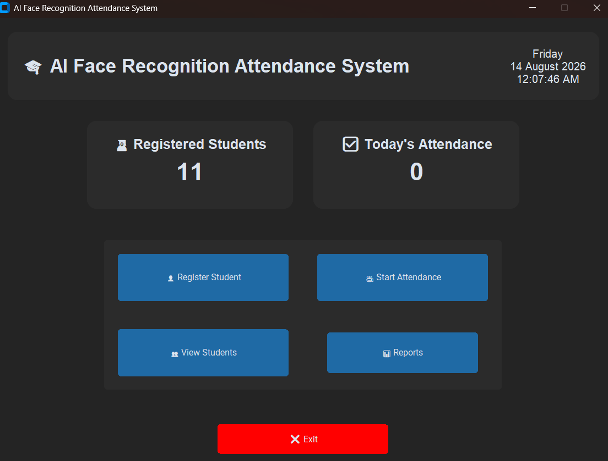
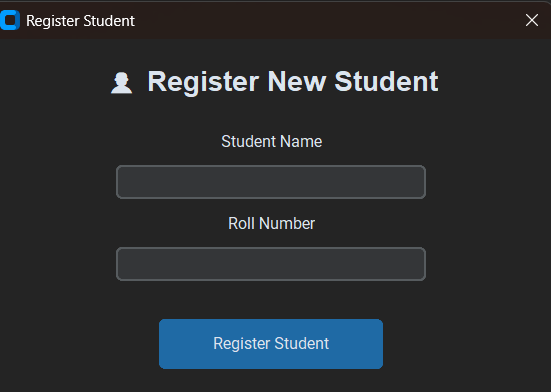
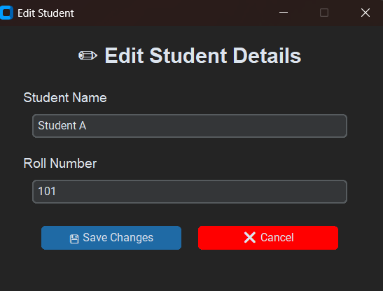
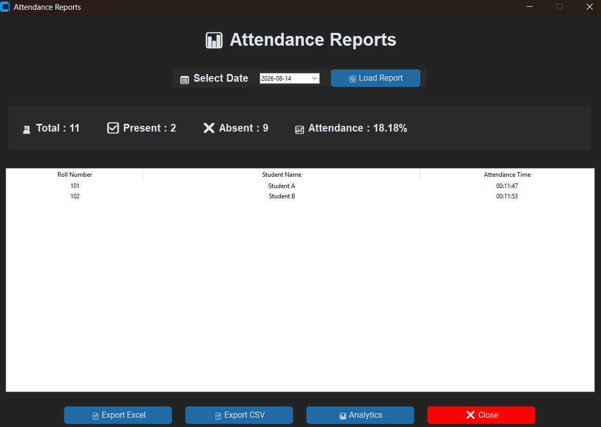
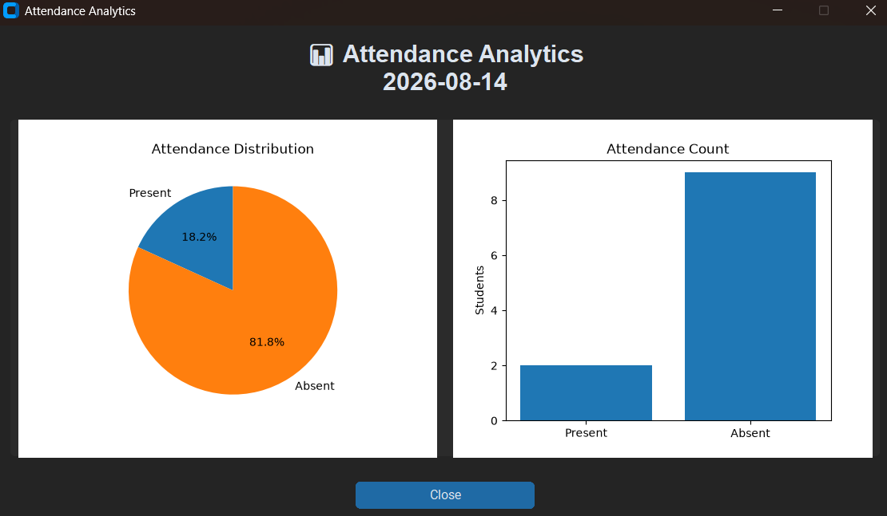

# AI-Powered Face Recognition Attendance Management System

An AI-powered desktop attendance management system that uses **face recognition and computer vision** to identify registered students and automatically record their attendance.

The system combines **InsightFace**, **OpenCV**, **SQLite**, and a **CustomTkinter GUI** to provide student registration, face recognition, attendance tracking, student management, analytics, and report generation.

---

## 📌 Project Overview

Traditional attendance systems can be time-consuming and may require manual entry.

This project automates the attendance process by recognizing a registered student's face through a webcam and recording their attendance in a local SQLite database.

The system provides a graphical dashboard for managing students and viewing attendance information.

---

## 📸 Screenshots

### 🏠 Dashboard



The main dashboard provides access to student registration, attendance, student management, and reporting features.

### 👤 Student Registration



The registration interface allows new students to enter their details and begin the face registration process.

### ✏️ Edit Student Details



Student information such as name and roll number can be updated through the edit interface.

### 📋 Attendance Reports



The attendance reports section displays attendance statistics, student records, attendance times, and provides CSV and Excel export options.

### 📊 Attendance Analytics



The analytics section provides visual representations of attendance distribution and attendance counts.

> **Privacy Note:** Screenshots included in this repository use fictional demonstration data. Face images, biometric data, and personal attendance records are intentionally excluded from the public repository.


### Main Workflow

```text
Register Student
       ↓
Capture Face Images
       ↓
Generate Face Embedding
       ↓
Store Student Information
       ↓
Start Attendance
       ↓
Capture Live Face
       ↓
Compare With Stored Embeddings
       ↓
Recognize Student
       ↓
Check Today's Attendance
       ↓
Mark Attendance / Show Already Marked
```
---
## ✨ Features

### 👤 Student Registration

- Register students using their name and roll number
- Capture multiple face images through a webcam
- Generate face embeddings using InsightFace
- Store student information in a local SQLite database
- Prevent duplicate student registration

### 🧠 Face Recognition

- Uses InsightFace for face detection and recognition
- Generates 512-dimensional face embeddings
- Compares live face embeddings with stored embeddings
- Uses similarity-based face matching
- Identifies registered students from the webcam feed
- Displays unregistered faces as **Unknown**

### 📋 Attendance Management

- Automatically marks attendance after successful recognition
- Records attendance date and time
- Prevents duplicate attendance for the same student on the same day
- Displays an **Already Marked** status when attendance has already been recorded

### 📊 Dashboard

- Displays total registered students
- Displays today's attendance information
- Provides access to different system modules
- Includes student and attendance management features

### 👨‍🎓 Student Management

- View registered students
- Search student records
- Edit student information
- Manage student details through the graphical interface

### 📈 Analytics & Reports

- View attendance information
- Generate attendance reports
- Export attendance data
- Supports CSV and Excel export functionality

### 🧪 Testing

The project includes separate test files for important components, including:

- Attendance management
- Database operations
- Face embeddings
- Student lookup
- InsightFace
- Saved embeddings

---

## 🛠️ Technologies Used

| Technology | Purpose |
|---|---|
| **Python** | Core programming language |
| **InsightFace** | Face detection and face embeddings |
| **OpenCV** | Webcam access and image processing |
| **NumPy** | Numerical operations and embedding comparison |
| **CustomTkinter** | Graphical user interface |
| **SQLite** | Student and attendance database |
| **CSV** | Attendance data export |
| **Excel** | Attendance report export |

---

## 🧠 Face Recognition Approach

The system uses the **InsightFace `buffalo_l` model** for face analysis.

### During Student Registration
1. The webcam captures face images.
2. InsightFace detects the face.
3. Face embeddings are generated from the captured images.
4. The generated embedding is stored locally.
5. Student information is stored in the SQLite database.

### During Attendance
1. The webcam captures a live frame.
2. InsightFace detects the face.
3. A face embedding is generated from the live face.
4. The live embedding is compared with the stored student embeddings.
5. The system determines the closest matching registered student.
6. If the similarity meets the configured recognition threshold, the student is recognized.
7. The system checks whether attendance has already been recorded for the current date.
8. If attendance has not been recorded, it is marked with the current date and time.
9. If attendance already exists, the system displays **Already Marked**.
10. If no registered face matches, the person is displayed as **Unknown**.

---

## 🏗️ System Architecture

```text
                    ┌───────────────────────┐
                    │    GUI Dashboard      │
                    └───────────┬───────────┘
                                │
             ┌──────────────────┼──────────────────┐
             │                  │                  │
             ▼                  ▼                  ▼
      Student Registration   Attendance       Management
             │                  │                  │
             ▼                  ▼                  ▼
       Face Capture        Face Capture      SQLite Database
             │                  │
             ▼                  ▼
        InsightFace        InsightFace
             │                  │
             ▼                  ▼
      Face Embedding     Live Embedding
             │                  │
             └──────────┬───────┘
                        ▼
                Face Recognition
                        │
                        ▼
                 Student Matching
                        │
                        ▼
                Attendance Check
                        │
                ┌───────┴───────┐
                ▼               ▼
          Mark Attendance   Already Marked
                │
                ▼
             SQLite
```
---

## 📂 Project Structure

```text
FaceRecognitionAttendance/
│
├── app.py
├── main.py
├── config.py
├── requirements.txt
├── README.md
├── LICENSE
├── .gitignore
│
├── database/
│   └── create_database.py
│
├── gui/
│   ├── analytics_window.py
│   ├── dashboard.py
│   ├── edit_student_window.py
│   ├── main_window.py
│   ├── register_window.py
│   ├── reports_window.py
│   └── students_window.py
│
├── utils/
│   ├── attendance_manager.py
│   ├── camera.py
│   ├── database_manager.py
│   ├── export_csv.py
│   ├── export_excel.py
│   ├── face_detector.py
│   ├── face_encoder.py
│   ├── file_manager.py
│   ├── recognizer.py
│   ├── register_student.py
│   └── validators.py
│
└── test_*.py
```

> **Note:** Face images, generated face embeddings, attendance database files, reports, and the Python virtual environment are intentionally excluded from this public repository through `.gitignore`.

---

## ⚙️ Installation

### 1. Clone the repository

```bash
git clone https://github.com/ananyasharma131006/AI-Powered-Face-Recognition-Attendance-Management-System.git
```

### 2. Navigate to the project directory

```bash
cd AI-Powered-Face-Recognition-Attendance-Management-System
```

### 3. Create a virtual environment

```bash
python -m venv venv
```

### 4. Activate the virtual environment

#### Windows PowerShell

```powershell
venv\Scripts\Activate.ps1
```

#### Windows Command Prompt

```cmd
venv\Scripts\activate
```

### 5. Install dependencies

```bash
pip install -r requirements.txt
```

---

## ▶️ Running the Application

Start the application using:

```bash
python main.py
```

The graphical interface will open and provide access to the available system modules.

---

## 👤 Student Registration

To register a new student:

1. Open the application.
2. Select **Register Student**.
3. Enter the student's name.
4. Enter the student's roll number.
5. Allow the webcam to capture the student's face images.
6. The system processes the captured images using InsightFace.
7. A face embedding is generated and stored locally.
8. The student's details are added to the database.

The generated face data remains local and is **not included in this public GitHub repository**.

---

## 📋 Attendance Process

To mark attendance:

1. Start the attendance system.
2. Allow webcam access.
3. The camera captures the live face.
4. InsightFace detects and processes the face.
5. The generated embedding is compared with registered embeddings.
6. If a registered student is recognized, the system checks the attendance database.
7. If attendance has not been marked for the current day, it is recorded.
8. If attendance has already been recorded, the system displays **Already Marked**.
9. If the face does not match any registered student, it is displayed as **Unknown** and attendance is not recorded.

---

## 🧪 Testing

The project contains test scripts for different components of the system:

```text
test_attendance.py
test_database.py
test_embedding.py
test_get_student.py
test_insightface.py
test_saved_embedding.py
```

Individual tests can be executed using:

```bash
python test_attendance.py
```

or:

```bash
python test_database.py
```

Additional test files can be executed in the same way.

---

## 🔐 Privacy & Data Handling

This project works with facial images and face embeddings, so responsible data handling is important.

The following files and directories are intentionally **excluded from this public repository**:

- Student face images
- Test images
- Generated face embeddings
- Attendance database
- Generated reports
- Python virtual environment
- Python cache files

These are excluded using the project's `.gitignore` configuration.

Users should use their own authorized images and test data when running the system.

---

## 🚀 Future Improvements

Possible future enhancements include:

- Improve recognition under different lighting conditions
- Improve recognition at larger face-to-camera distances
- Add stronger face-quality validation during registration
- Add anti-spoofing and liveness detection
- Add administrator authentication
- Add role-based access control
- Add cloud database support
- Add remote attendance monitoring
- Improve dashboard visualizations
- Add configurable recognition thresholds
- Improve cross-platform deployment

---

## 📌 Project Status

**Status: Completed Prototype / Portfolio Project**

The core workflow has been tested, including:

- ✅ Student registration
- ✅ Face image capture
- ✅ Face embedding generation
- ✅ Database registration
- ✅ Registered-student recognition
- ✅ Attendance marking
- ✅ Duplicate attendance prevention
- ✅ Unknown-person handling

---

## 👩‍💻 Author

**Ananya Sharma**

B.Tech CSE (AI & ML) Student

GitHub:  
https://github.com/ananyasharma131006

---

## 📄 License

This project is licensed under the **MIT License**.